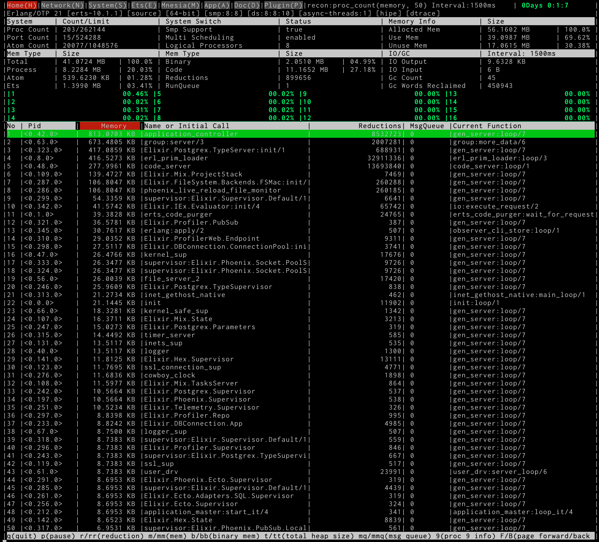

この記事は[fukuoka.ex Elixir/Phoenix Advent Calendar 2018](https://qiita.com/advent-calendar/2018/fukuokaex)の24日目の記事になります

この度は書いてみませんか？という提案を受けて、お世話になってるfukuoka.exのAdventCalendarに混ぜてもらいました！

昨日は[yoshitake_1201](https://qiita.com/yoshitake_1201)さんの[【小ネタ】Eixirのパイプ演算子使用中に第一引数の値を第二引数に渡す方法](https://qiita.com/yoshitake_1201/items/76a2edcd6270f0d2f25e)でした

テストエンジニアとして[弊社](https://fusic.co.jp/)にJoinしてくれて新しい技術を取り込もうと勢力的に動いています

## 今日書くこと

最近[PHP Conference 2018](http://phpcon.php.gr.jp/2018/)でお話させて頂く機会があり、  
PHPとGoとElixirのパフォーマンスについてお話してきました

その中で知ったprofilerについて比較を行ってみようと思います

### プロファイリングしたい環境

- Elixirのバージョン
    - Elixir 1.7.4
- Erlang/OTPのバージョン
    - Erlang/OTP 21
- Phoenixのバージョン
    - Phoenix v1.4.0

## profilerに関して

fukuoka.exのメンバーに教えてもらったものと自分自身で調べた、以下のprofilerについて比較を行いました

- 利用するprofiler
    - [observer_cli](https://github.com/zhongwencool/observer_cli)
        - Github上のStar644
    - [benchfella](https://github.com/alco/benchfella)
        - Github上のStar375
    - [xprof](https://github.com/Appliscale/xprof)
        - Github上のStar200
    - [exprof](https://github.com/parroty/exprof)
        - Github上のStar104

## 所感
GithubのStar数は嘘をつかない

### observer_cli

ほんと素晴らしくてローカルで利用することも、リモートで別サーバで利用することも出来るようです

今回はローカルで試してます

Phoenixを立ち上げた状態で以下コマンドを実行

```
$ iex -S mix
iex(1)> :observer_cli.start
```

すると次のような結果が表示されます



現在 beam上で動作しているProcessのメモリだったりIOのInput/Output、GCの様子さえわかります

DB Poolで開いているコネクションだったり、どのProcessがメモリを使ってるのか、どの様なアプリが動いているのか等

片っ端から情報を与えてくれます

ただし、僕のイメージしてた関数の実行結果をプロファイリングしてくれるようなものはなさそう？です

でもかなり簡単に使える割に情報量は多く良さそう

### benchfella

[@piacere_ex](https://qiita.com/piacere_ex)さんに教えてもらったツール

自らの手で記述した結果のベンチマークを取ってくれるツール

以下の様にSampleのコードを`bench/basic_bench.exs`に配置します

```
defmodule BasicBench do
  use Benchfella

  @list Enum.to_list(1..1000)

  bench "hello list" do
    Enum.reverse @list
  end
end
```

その後Benchコマンド実行

```
$ mix bench
Settings:
  duration:      1.0 s

## BasicBench
[00:49:12] 1/1: hello list

Finished in 2.36 seconds

## BasicBench
benchmark n iterations   average time
hello list      500000   3.86 µs/op
```

@piacere_exさんはこれをCIと連携してるとのこと

確かにコアの処理速度担保の為に常にCIで回すのいいなと思いました

### xprof

関数プロファイリング出来るっぽいしGUIもあってわかりやすそうなので個人的に本命…しかし…

-----
```
$ mix deps.get
Resolving Hex dependencies...

Failed to use "cowboy" (version 2.6.1) because
  plug_cowboy (version 2.0.1) requires ~> 2.5
  xprof (version 1.3.0) requires 1.1.2
  mix.lock specifies 2.6.1

** (Mix) Hex dependency resolution failed,  
  change the version requirements of your dependencies or unlock them   
  (by using mix deps.update or mix deps.unlock).  
  If you are unable to resolve   
  the conflicts you can try overriding with {:dependency, "~> 1.0", override: true}
```

-----

`mix deps.update --all` && `overrid: true`を追加

-----
```
$ mix deps.update --all
Resolving Hex dependencies...

Failed to use "cowboy" (versions 2.5.0 to 2.6.1) because
  plug_cowboy (versions 2.0.0 and 2.0.1) requires ~> 2.5
  xprof (version 1.3.0) requires 1.1.2

** (Mix) Hex dependency resolution failed,  
  change the version requirements of your dependencies or unlock them   
  (by using mix deps.update or mix deps.unlock).  
  If you are unable to resolve   
  the conflicts you can try overriding with {:dependency, "~> 1.0", override: true}
```

-----

ぐぬぬ…RC版あるのでそっちで

-----

```
$ mix deps.update --all
Resolving Hex dependencies...

Failed to use "cowboy" (versions 2.5.0 to 2.6.1) because
  plug_cowboy (versions 2.0.0 and 2.0.1) requires ~> 2.5
  xprof_gui (version 2.0.0-rc.4) requires 2.0.0


** (Mix) Hex dependency resolution failed,  
  change the version requirements of your dependencies or unlock them   
  (by using mix deps.update or mix deps.unlock).  
  If you are unable to resolve   
  the conflicts you can try overriding with {:dependency, "~> 1.0", override: true}
```
-----

無理っぽい…(ちなみに xprof_gui 2.0.0-rc.4)を入れても駄目でした…  

残念ながら諦める方向で...

### exprof

`A simple code profiler for Elixir using eprof.`との事でPhoenixに挟むのは難しそう…

実際色んな所に`profile`を挟んでみたのですが、明らかに結果が足りなかったりそもそもCompileに失敗したり…

[こちら](https://medium.com/@ron.arts/optimizing-elixir-phoenix-performance-a50f7c92b9e4)でも機能不足なのでやめたって書いてあり心が折れました…

## まとめ

xprofが使えないのはちょっと残念…深掘りして使えるまで粘っても良かったのですが、そもそも開発が止まっているようだったので  
粘るのもな、と思ってしまいました

僕のスキル不足もあるのかもしれませんが、結局GithubのStar数がついてる奴が利用する障壁が低く、効力も高そうでした

OSSを作る上で非常に重要な要素として、利用しやすさも重要かなと考える検証となりました…

僕が知らないだけかもですが、関数プロファイリング部分のOSS狙ってもいいかもですね

明日は [@piacere_ex](https://qiita.com/piacere_ex)さんの記事です！楽しみですね！
