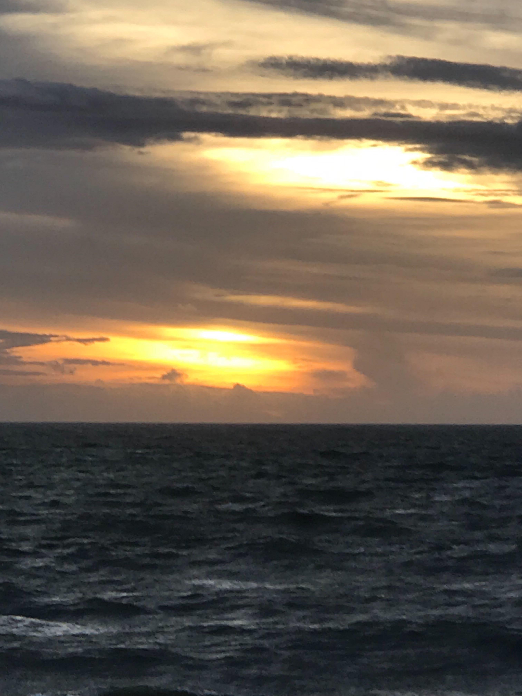
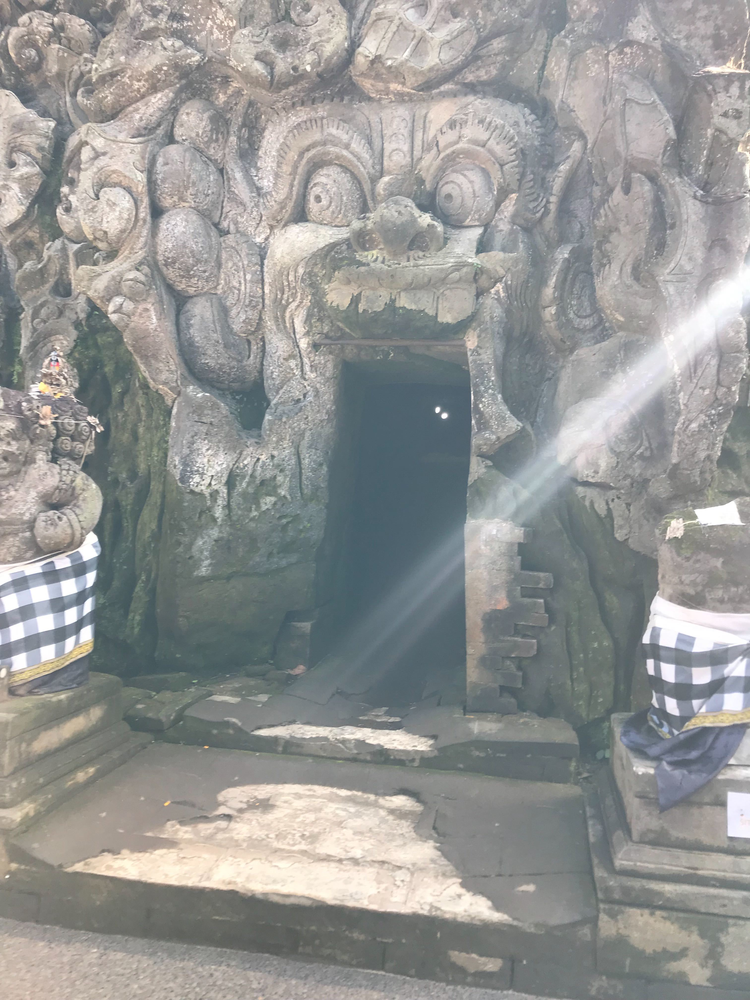
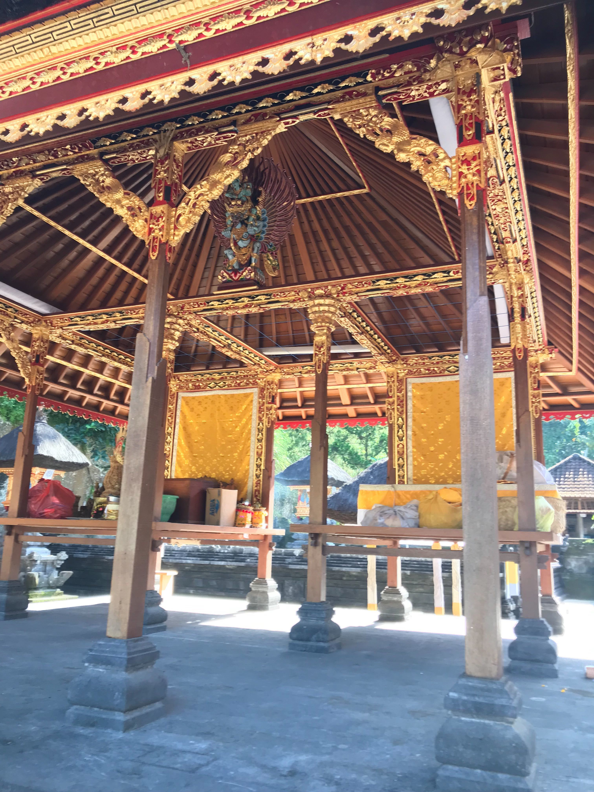
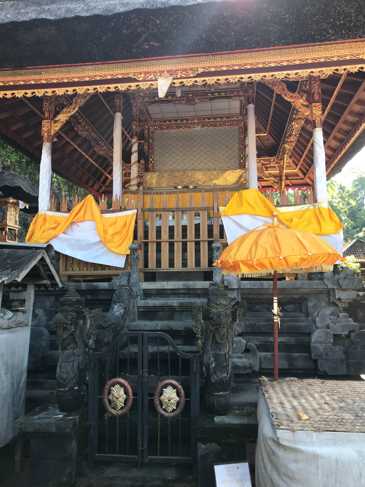
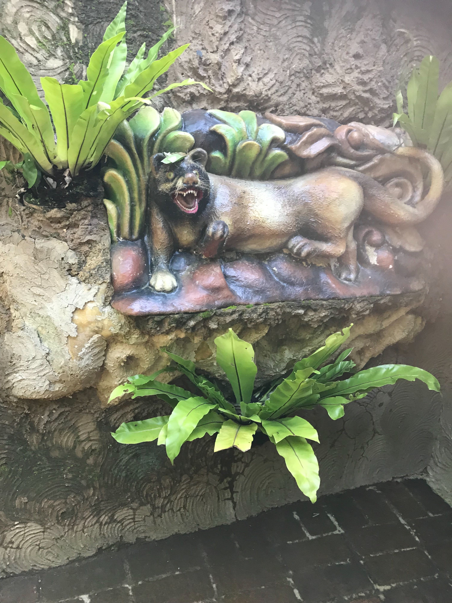
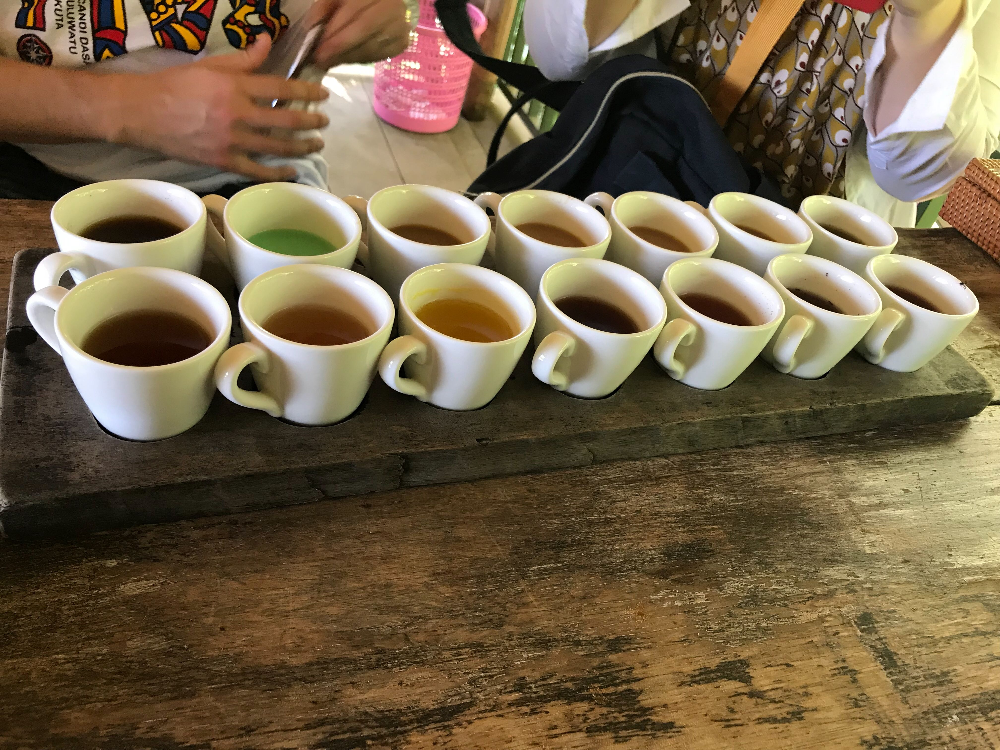
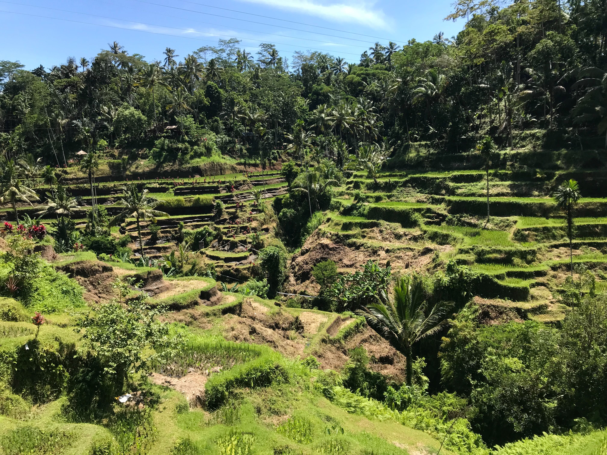
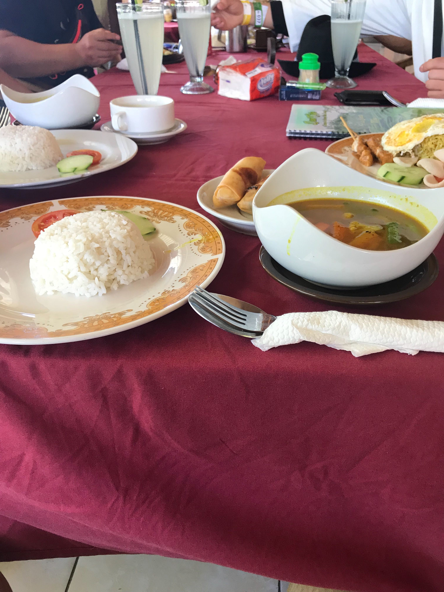
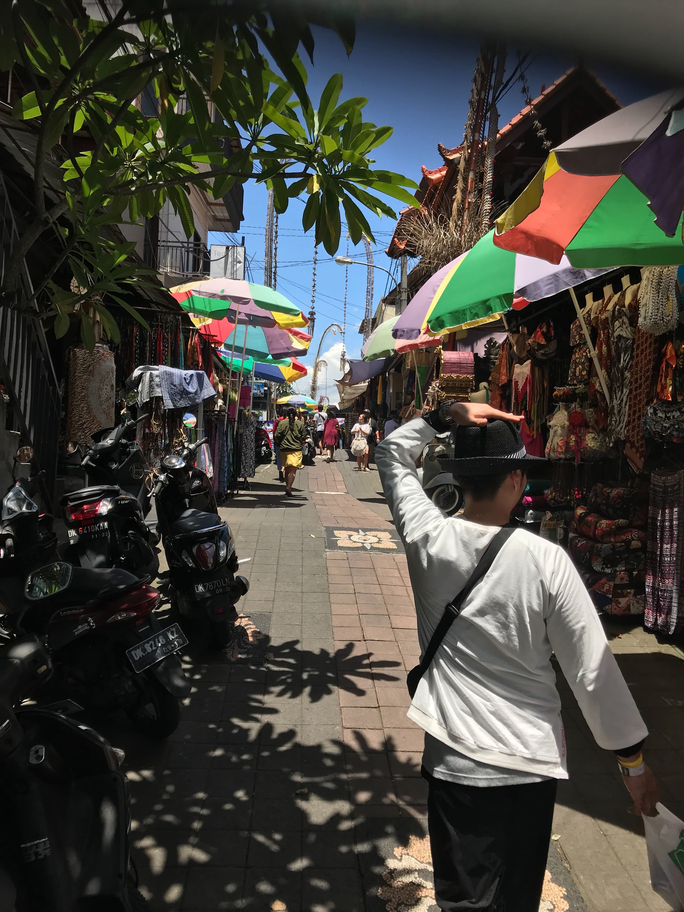

タイトルの通り、社員旅行でバリに行ってきました

単純に楽しかったのと、Fusicに入りたいなーって思ってくれてる人に  
楽しさが伝われば良いなと思ってブログに書くことにしました

## 初日

朝、福岡空港に集合してまずはインドネシアの空港に向かいました

飛行機で6時間ほどかかるのですぐに始めることにしました

<blockquote class="twitter-tweet" data-lang="ja">
始まってる <a href="https://t.co/81U7WVKDXt">pic.twitter.com/81U7WVKDXt</a>
&mdash; せいけしろー (@seike460) <a href="https://twitter.com/seike460/status/1088226198449152000?ref_src=twsrc%5Etfw">2019年1月24日</a></blockquote>

機内サービスの映画で [カメラを止めるな！](http://kametome.net/index.html)やってたので  
機内食と無限タイガービールで楽しく機内を過ごせて最高でした

シンガポールの空港ではあまり時間もなく、ただただ乗り継ぎを行い、飛行機でバリの空港に移動

ダウンロードしておいたAmazon Prime Video消化しながら機内食と無限タイガービール飲んでて  
お腹いっぱいで飛行機の旅を終えました

空港で早速事前購入してた[SIM](https://www.amazon.co.jp/gp/product/B006H7BKXG/)に入れ替えしてインターネットを得て精神を安定させホテルに向かいました  
すごい豪華なホテルで最高でした

<blockquote class="twitter-tweet" data-lang="ja">
ホテル凄い良い <a href="https://t.co/HTaFb5Pb3x">pic.twitter.com/HTaFb5Pb3x</a>
&mdash; せいけしろー (@seike460) <a href="https://twitter.com/seike460/status/1088416928992034818?ref_src=twsrc%5Etfw">2019年1月24日</a></blockquote>

### 泊まったホテル

<iframe src="https://www.facebook.com/plugins/post.php?href=https%3A%2F%2Fwww.facebook.com%2Fseike460%2Fposts%2F2045829208865371&width=500" width="500" height="300" style="border:none;overflow:hidden" scrolling="no" frameborder="0" allowTransparency="true" allow="encrypted-media"></iframe>

チェックイン後、ホテルのディナーだったのですが、完全に機内食と無限ビールの影響でお腹いっぱいなので  
ミーゴレンを少しだけ食べてビール飲んでました

<blockquote class="twitter-tweet" data-lang="ja">
ビンタンビール <a href="https://t.co/Ka6u2ZVe9W">pic.twitter.com/Ka6u2ZVe9W</a>
&mdash; せいけしろー (@seike460) <a href="https://twitter.com/seike460/status/1088431642442493953?ref_src=twsrc%5Etfw">2019年1月24日</a></blockquote>

その後は社長と一緒に社員の希望者でガイドさん(バリに十年在住)オススメの中華屋さんでご飯

お腹いっぱいだけど、美味しかったので無理やり食べて飲んでました

食べ終わると既に深夜だったので、大人しく寝ることにしました

というわけで、移動しながら24時間ひたすらビール飲んでる日でした

## 二日目

朝からビーチに移動する予定だったので、起きてホテルからの景色を撮って後  
ホテルのビュッフェで食事してました

<blockquote class="twitter-tweet" data-lang="ja">
ホテルからの景色 <a href="https://t.co/R06kk3YLtm">pic.twitter.com/R06kk3YLtm</a>
&mdash; せいけしろー (@seike460) <a href="https://twitter.com/seike460/status/1088566051015516160?ref_src=twsrc%5Etfw">2019年1月24日</a></blockquote>

その後、ビーチに移動してまずはみんなで運動

<blockquote class="twitter-tweet" data-lang="ja">
ビーチフラッグは良いんだけど、何故か綱引きと大縄跳びしてた
&mdash; せいけしろー (@seike460) <a href="https://twitter.com/seike460/status/1088649848511959040?ref_src=twsrc%5Etfw">2019年1月25日</a></blockquote>

バナナボートとパラセーリングをしました  
一部社長のポケットマネーから出てるらしくて、社員に愛されている片鱗を覗かせてました  
(この件に関わらず単純に異常にいい人、Fusicで働きたい理由の一つです)

<blockquote class="twitter-tweet" data-lang="ja">
こんな感じです <a href="https://t.co/sOSDxXzTpK">pic.twitter.com/sOSDxXzTpK</a>
&mdash; せいけしろー (@seike460) <a href="https://twitter.com/seike460/status/1088658926470602753?ref_src=twsrc%5Etfw">2019年1月25日</a></blockquote>

### 行ったビーチ

<iframe src="https://www.facebook.com/plugins/post.php?href=https%3A%2F%2Fwww.facebook.com%2Fseike460%2Fposts%2F2044717102309915&width=500" width="500" height="300" style="border:none;overflow:hidden" scrolling="no" frameborder="0" allowTransparency="true" allow="encrypted-media"></iframe>

その後のFusicの社員旅行条件の一つ、「世界遺産のあるところに行く」  
その目的地である「タマン・アユン寺院」に行きました

<blockquote class="twitter-tweet" data-lang="ja">
世界遺産らしい <a href="https://t.co/dRnxpGYEy1">pic.twitter.com/dRnxpGYEy1</a>
&mdash; せいけしろー (@seike460) <a href="https://twitter.com/seike460/status/1088713822804824064?ref_src=twsrc%5Etfw">2019年1月25日</a></blockquote>

### タマン・アユン寺院

<iframe src="https://www.facebook.com/plugins/post.php?href=https%3A%2F%2Fwww.facebook.com%2Fseike460%2Fposts%2F2044945195620439&width=500" width="500" height="300" style="border:none;overflow:hidden" scrolling="no" frameborder="0" allowTransparency="true" allow="encrypted-media"></iframe>

次に、サンセットで有名なタナロット寺院に行きました

少し曇りがかってましたがキレイでした

最後はフレンチで食事、めちゃくちゃ美味しかった

<blockquote class="twitter-tweet" data-lang="ja">
バリでフレンチ出てきた <a href="https://t.co/tUjVL11U3t">pic.twitter.com/tUjVL11U3t</a>
&mdash; せいけしろー (@seike460) <a href="https://twitter.com/seike460/status/1088785442772791298?ref_src=twsrc%5Etfw">2019年1月25日</a></blockquote>

その後ホテルに帰り、受付ギリギリでしたが全身アロマオイルマッサージ  
価格はなんと一時間千円程度で、最高に気持ちよかったので、次の日も行こうと心に決めました

飲みに行こうか迷ったのですが、この日もビーチから飲み始めて寺院巡りでもビール見つけては買って飲んでたので  
次の日に備えて大人しく寝ることにしました

## 最終日

最終日は自由行動の日でした

- サーフィン
- スパ
- ゴルフ
- 観光

などなど各々が思い思いに行動してました  
僕は複数人でガイドを手配して早朝からウブド地域行くことになってました  
ホテルのをビュッフェで軽く食事してからマイクロバスで移動

時間調整に銀細工の工場で買い物したりしながらゴアガジャ遺跡へ

神秘的だったのと、ガイドさんがユニークな方で飽きずに楽しめました

その後、ジャコウネココーヒーで有名な Pawon Luwak coffee で飲み比べしたり

ライステラスを見ながらカレー食べたり

ウブド市場に行ってお土産を買ったり時間の許す限り観光しました

その後竹細工の工場で妻へのお土産も買って、満喫しつくしてホテルに到着

集合時間のまでギリギリ一時間あったので、足マッサージの一時間コースを受けてホテルに集合

インドネシアの伝統文化鑑賞しながらインドネシアディナー

その後は帰るだけなので割愛

## 感想

所謂、「控えめに言って最高」でした

Fusicでは自由に働かせてもらうだけでも十分良い会社なのですが、最高な福利厚生もあり魅力的な会社だと思ってます

社長がまた行きたいって言ってた↓ので、お約束はできませんが入社すれば最高体験出来る可能性があります

<iframe src="https://www.facebook.com/plugins/post.php?href=https%3A%2F%2Fwww.facebook.com%2Fsadayoshi.noutomi%2Fposts%2F2282501821794928&width=500" width="500" height="500" style="border:none;overflow:hidden" scrolling="no" frameborder="0" allowTransparency="true" allow="encrypted-media"></iframe>

もしご興味のある方いれば、[ここから応募してみたり](https://fusic.github.io/)僕に直接[TwitterでDMしてみたり](https://twitter.com/seike460)してください！

カジュアル面接とかもありますよ

てわけで、明日からまた頑張ろうと思います！
