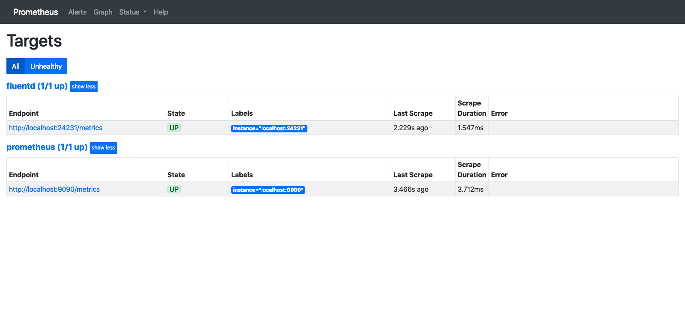

手元にPrometheusの環境が欲しくなったので、  
Amazon Linux2にPrometheusを構築する手順をまとめます

## 構成

- Amazon Linux2
- Prometheus 2.8.0
- fluentd 1.3.3

Prometheus,fluentdは同じサーバーに構築します

2019-03-16時点での手順を元に構築します  
情報が古くなっている場合は適宜確認しながら構築してください

[Prometheus GETTING STARTED](https://prometheus.io/docs/prometheus/latest/getting_started/)

## Prometheus インストール

[ダウンロードページ](https://prometheus.io/download/) からPrometheusをダウンロードして解凍します

```bash
$ wget https://github.com/prometheus/prometheus/releases/download/v2.8.0/prometheus-2.8.0.linux-amd64.tar.gz
$ tar xvfz prometheus-2.8.0.linux-amd64.tar.gz
$ cd prometheus-2.8.0.linux-amd64/
```

バイナリ起動するだけでとりあえず動きはします  
デフォルトでは9090PortをBindしますので、EC2上に構築時は SecurityGroup に気をつけてください

```bash
./prometheus
```

簡単すぎますね OSSは導入難易度の低さは非常に重要な要素だと再認識

## fluentd インストール

[Installing and Updating the Treasure Data CLI](https://support.treasuredata.com/hc/en-us/articles/360001525887-Installing-and-Updating-the-Treasure-Data-CLI#Amazon%20Linux)

CLIで一発です

```
$ curl -L https://toolbelt.treasuredata.com/sh/install-amazon2-td-agent3.sh | sh
```

Prometheusと連携させる為に、fluent-plugin-prometheusをインストールします

```bash
$ sudo td-agent-gem install fluent-plugin-prometheus
```

簡単すぎますね OSSは導入難易度(ry

## Prometheus fluentd 連携

td-agentにMetrics取得用のendpointを設定  

```bash
$ sudo vim /etc/td-agent/td-agent.conf
```

```vim:title=/etc/td-agent/td-agent.conf
<source>
  @type prometheus
  bind 0.0.0.0
  port 24231
  metrics_path /metrics
</source>
<source>
  @type prometheus_monitor
  interval 10
  <labels>
    hostname ${hostname}
  </labels>
</source>
<source>
  @type prometheus_output_monitor
  interval 10
  <labels>
    hostname ${hostname}
  </labels>
</source>
<source>
  @type prometheus_tail_monitor
  interval 10
  <labels>
    hostname ${hostname}
  </labels>
</source>
```

td-agentの再起動

```bash
$ systemctl restart td-agent.service
```

Prometheus に td-agentが提供するendpointを監視する設定を追加  
Node exporterを監視する様に scrape_configs に記述します

```vim:title=prometheus.yml
scrape_configs:

  〜省略〜

  - job_name: 'fluentd'
    static_configs:
      - targets: ['localhost:24231']
```


## Prometheus daemon化

systemctl 用の設定を作成します

```
$ sudo vim /usr/lib/systemd/system/prometheus.service
```

```vim:title=/usr/lib/systemd/system/prometheus.service
[Unit]
Description=Prometheus
Documentation=https://prometheus.io/docs/introduction/overview/
After=network-online.target
After=td-agent.service
Requires=td-agent.service

[Service]
Type=simple
ExecStart=/usr/local/src/prometheus/prometheus \
  --config.file=/usr/local/src/prometheus/prometheus.yml
Restart=always
ExecReload=/bin/kill -HUP $MAINPID

[Install]
WantedBy=multi-user.target
```

自動起動設定と実際の起動

```bash
$ sudo systemctl daemon-reload
$ sudo systemctl enable prometheus.service
$ sudo systemctl start prometheus.service
```

ついでにtd-agent.serviceも自動起動設定

```bash
$ sudo systemctl enable td-agent.service
```

Targetsに認識されました


次回はGrafanaで可視化する流れを書きたいと思います
