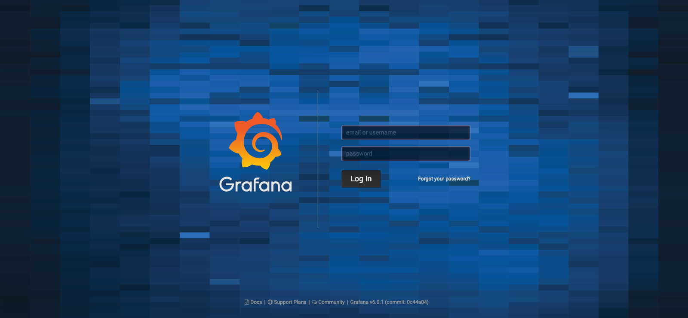
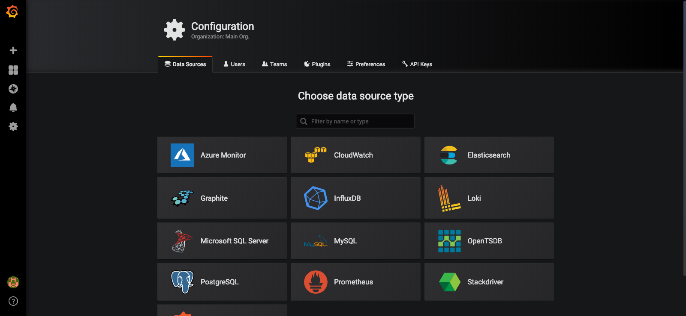
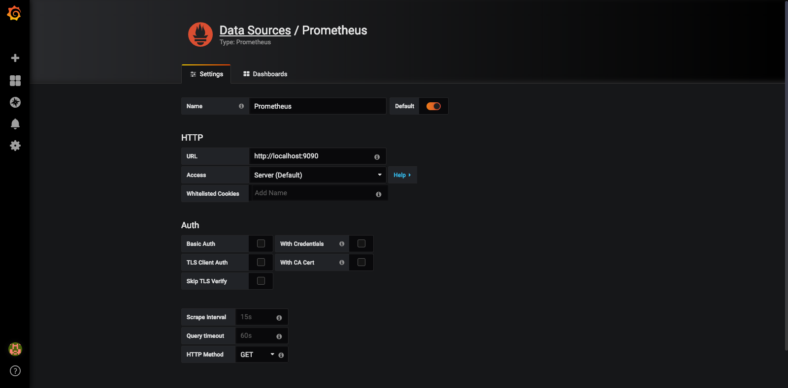
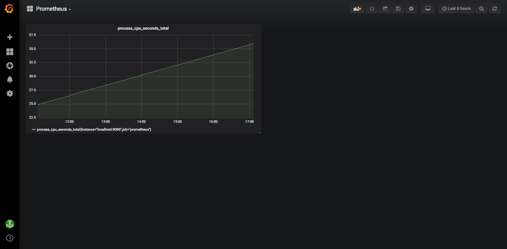

[前回に引き続き](/2019/03/16/Prometheus/)Grafanaを構築します
Prometheusとfluentdは[前回のものを](/2019/03/16/Prometheus/)参照してください

## 構成

- Amazon Linux2
- Prometheus 2.8.0
- fluentd 1.3.3
- Grafana 6.0.1-1

## Grafana インストール

[Download Grafana](https://grafana.com/grafana/download?platform=linux)を参考にインストールします

```bash
$ curl https://dl.grafana.com/oss/release/grafana-6.0.1-1.x86_64.rpm -O
$ sudo yum localinstall grafana-6.0.1-1.x86_64.rpm
```

直接yum installしても大丈夫です

```bash
$ sudo yum install https://dl.grafana.com/oss/release/grafana-6.0.1-1.x86_64.rpm
```

systemctl設定も作成してくれていますので起動するだけで良いです

```
$ sudo systemctl start grafana-server.service
```

デフォルトでは3000番PortをBindするようになってます

見る頻度が高い画面だと思うのでNginxを前段に立てるようにします

[behind_proxy](http://docs.grafana.org/installation/behind_proxy/)の手順で進めます

## Nginx reverse proxy設定

NginxはAmazonが提供しているものを利用します
```bash
$ sudo amazon-linux-extras install nginx1.12
```

HTTPS化する為、Let's EnctyptかALBを噛ますか迷ったのですが、  
料金を増やしたく無いのでLet's Enctypt対応することにしました

[Nginx on CentOS/RHEL 7](https://certbot.eff.org/lets-encrypt/centosrhel7-nginx)

まずは amazon-linux-extras 経由で epel repository追加して certbot 入手します

```bash
$ sudo amazon-linux-extras install epel
$ sudo yum install certbot python2-certbot-nginx
```

SecurityGroupにて接続できるIPを制限してるのでDNS経由での認証を行います  
`hoge.seike460.com`は適宜読み替えてください

```bash
$ sudo certbot certonly --preferred-challenges dns-01 --authenticator manual --domain hoge.seike460.com
Saving debug log to /var/log/letsencrypt/letsencrypt.log
Plugins selected: Authenticator manual, Installer None
Obtaining a new certificate
Performing the following challenges:
dns-01 challenge for hoge.seike460.com

- - - - - - - - - - - - - - - - - - - - - - - - - - - - - - - - - - - - - - - -
NOTE: The IP of this machine will be publicly logged as having requested this
certificate. If you're running certbot in manual mode on a machine that is not
your server, please ensure you're okay with that.

Are you OK with your IP being logged?
- - - - - - - - - - - - - - - - - - - - - - - - - - - - - - - - - - - - - - - -
(Y)es/(N)o: y

- - - - - - - - - - - - - - - - - - - - - - - - - - - - - - - - - - - - - - - -
Please deploy a DNS TXT record under the name
_acme-challenge.hoge.seike460.com with the following value: !!! このTXTレコードを !!!

XxxxxxxxxxxxxxxxxxxxxxxxxxxxxxxxxxxxxxxxxxX !!! これをValueで作成 !!!

Before continuing, verify the record is deployed. !!! ここでDNS設定を行った後にEnter !!!
- - - - - - - - - - - - - - - - - - - - - - - - - - - - - - - - - - - - - - - -
Press Enter to Continue
Waiting for verification...
Cleaning up challenges

IMPORTANT NOTES:
 - Congratulations! Your certificate and chain have been saved at:
   /etc/letsencrypt/live/hoge.seike460.com/fullchain.pem
   Your key file has been saved at:
   /etc/letsencrypt/live/hoge.seike460.com/privkey.pem
   Your cert will expire on 2019-06-15. To obtain a new or tweaked
   version of this certificate in the future, simply run certbot
   again. To non-interactively renew *all* of your certificates, run
   "certbot renew"
 - If you like Certbot, please consider supporting our work by:

   Donating to ISRG / Let's Encrypt:   https://letsencrypt.org/donate
   Donating to EFF:                    https://eff.org/donate-le
```

よく見ると寄付リンクあったので寄付してみました  
感謝を伝えたい方は是非 ↓  
[Donating to ISRG / Let's Encrypt](https://letsencrypt.org/donate)

この証明書をありがたく使います

```bash
$ sudo vim /etc/nginx/nginx.conf
```

画像などはキャッシュさせながら80 -> 443にリダイレクトしてます

```vim:title=/etc/nginx/nginx.conf
http {

    ~ 省略 ~

    server {
        listen 80;
        server_name hoge.seike460.com
        return 301 https://$host$request_uri;
    }

    server {
        listen       443 ssl http2 default_server;
        server_name  hoge.seike460.com;
        root         /usr/share/nginx/html;

        ssl_certificate "/etc/letsencrypt/live/hoge.seike460.com/fullchain.pem";
        ssl_certificate_key "/etc/letsencrypt/live/hoge.seike460.com/privkey.pem";
        ssl_session_cache shared:SSL:1m;
        ssl_session_timeout  10m;
        ssl_ciphers HIGH:!aNULL:!MD5;
        ssl_prefer_server_ciphers on;

        include /etc/nginx/default.d/*.conf;

        proxy_set_header X-Real-IP  $remote_addr;
        proxy_set_header X-Forwarded-For $remote_addr;
        proxy_set_header X-Forwarded-Proto $scheme;
        proxy_set_header Host $host;

        location ~* .(ico|jpg|png|gif|jpeg|css|swf|js|woff)$ {
            access_log off;
            gzip_static on;
            gzip_comp_level 5;
            expires 1d;
            add_header Cache-Control private;
            try_files $uri @proxy;
        }
        location @proxy {
            proxy_pass http://localhost:3000;
        }
        location ~ {
            proxy_pass http://localhost:3000;
        }

        error_page 404 /404.html;
            location = /40x.html {
        }
        error_page 500 502 503 504 /50x.html;
            location = /50x.html {
        }
    }
```



雰囲気がもうカッコいいですね  
最初のログインアカウントは admin /admin になってて最初のログインを行うと  
パスワード変更を求められます

認証系のドキュメントをご参照ください

[authentication](http://docs.grafana.org/tutorials/api_org_token_howto/#authentication)

まずは DataSource の選択を求められるのでもちろんPrometheusを選びます



Prometheusは前回 localhost:9000に立ててたので指定すると連携が開始されます



Dashboardの作成すれば可視化出来る様になります  
この設定部分は別途Blog書こうと思います



ひとまず利用できる様になったので  
めでたしめでたし
