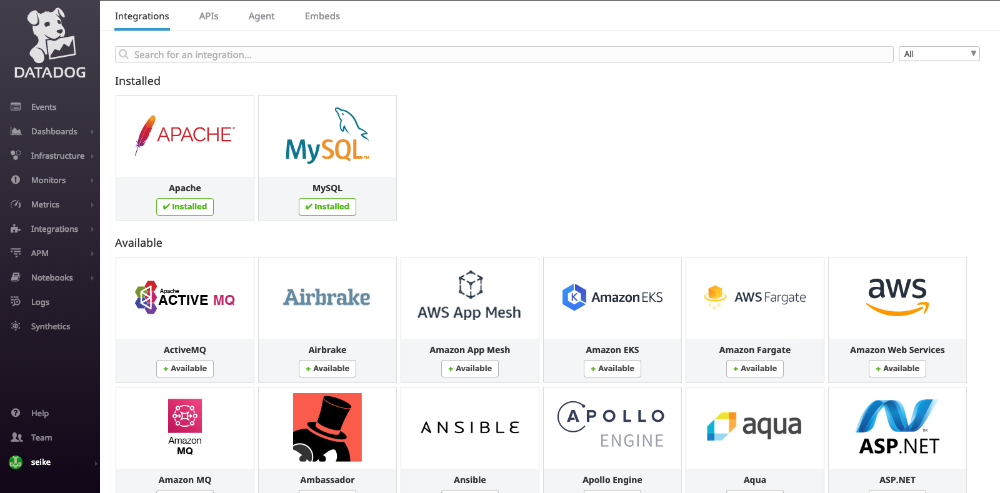

datadogを利用した監視の基礎設定をまとめます

- 監視対象
    - Amazon Linux2
- 対象サービス
    - Apache
    - MySQL

[サイト](https://www.datadoghq.com/)で難なく登録出来ると思いますのでアカウント登録は割愛します

## Install an Agent

画面に従っていくとコマンドまでコンソールが教えてくれるので  
それをCLIに貼り付けるだけです

```bash
DD_API_KEY=XxxxxxxxxxxxxxxxxxxxxxxxxxxxxxxX bash -c "$(curl -L https://raw.githubusercontent.com/DataDog/datadog-agent/master/cmd/agent/install_script.sh)"
```

この時点で最低限の情報は DataDogが集めてくれます

## Create a dashboard

特に説明するまでも無いのですが、Dashboardを作ります  
Dashboardには二種類あります

- Timeboard
    - トラブルシューティングに適する
- Screenboard
    - データ共有に適する

正直後でイジれるしどっちでも良いと思ってます

## Install integrations

integrationsのページから追加すれば良いのですが、  
わりとスラッとやってねみたいになってるので補足しながら進めます



### Apache
#### mod_status有効化

```bash
1. Install the Agent on your Apache servers.
2. Install mod_status on your Apache servers and enable ExtendedStatus.
```

Agentはインストール済みなので`mod_status`の読み込みと`ExtendedStatus`の有効化を行います  
玄人は知ってる方が多いと思うのですが  
mod_statusはApacheの状況を知れるendpointを提供するmoduleです

[Apache モジュール mod_status](https://httpd.apache.org/docs/2.2/ja/mod/mod_status.html)

`/etc/httpd/conf.modules.d/00-base.conf`で以下のように読み込まれているはずです

```vim:title=/etc/httpd/conf.modules.d/00-base.conf
LoadModule status_module modules/mod_status.so
```

`ExtendedStatus`の有効化とhandlerを追加します  
`virtualhosts.conf`に書くのが一般的ですかね

Agentからアクセスされるのでlocalhostのみ許可すれば良いです  
mod_rewrite環境では`.htaccess`等でrewriteされないようにご注意ください

またExtendedStatusはVirtualhostsディレクティブには記述出来ず  
設定ファイルレベルでの記述なことにもご注意ください
`httpd -t`や`apachectl configtest`にてconfigtestは怠らないようにしましょう

```vim:title=/etc/httpd/conf.d/virtualhosts.conf
ExtendedStatus On # !!!Virtualhostsディレクティブ外に書くこと###

  <Location /server-status> # !!!Virtualhostsディレクティブ利用時はディレクティブ内に書くこと!!!
    SetHandler server-status
    Order deny,allow
    Deny from all
    Allow from localhost
  </Location>
```

設定の修正を終えたらhttpd再起動します  
すると curl等でステータスが取れるはずです

```bash
$ curl http://localhost/server-status?auto
localhost
ServerVersion: ~ここから先は秘密~
```

#### datadog-agentの設定

`/etc/datadog-agent/conf.d/apache.d/`のファイルを変更します

`conf.yaml.example`を`auto_conf.yaml`にコピーして使うと  
コメントアウトしていくだけで良いので楽です

templateは最初からlocalhostを見にいくようにしてくれてます  
後はログの収集も有効化しておいたほうが良いと思います

必要な設定だけ抜き出すと以下の通りです  
pathやservice等は適宜調節してください

```vim:title=/etc/datadog-agent/conf.d/apache.d/auto_conf.yaml
init_config:
instances:
  - apache_status_url: http://localhost/server-status?auto
logs:
  - type: file
  - path: /var/log/httpd/access_log
  - source: apache
  - sourcecategory: http_web_access
  - service: apache
  - type: file
  - path: /var/log/httpd/error_log
  - source: apache
  - sourcecategory: http_web_access
  - service: apache
```

logの収集の為にはdatadog-agentの定義ファイルの`logs_enabled`設定の変更が必要です

```vim:title=/etc/datadog-agent/datadog.yaml
# Logs agent
#
# Logs agent is disabled by default
logs_enabled: true # trueに変更する
```

ここでdatadog-agentの再起動をするとApacheの情報がDatadog上に収集され始めます

```bash
$ sudo systemctl restart datadog-agent.service
```

### MySQL

MySQLは必要なユーザー作成と権限をDatadogに渡す事で監視が可能です  
MySQLに接続して以下のSQLの実行します  
パスワード部分の`XxxxxxxxxxxxxxxxxxxxxxxX`はDatadogのコンソールに生成を任せることも出来ます

```sql
CREATE USER 'datadog'@'localhost' IDENTIFIED BY 'XxxxxxxxxxxxxxxxxxxxxxxX';
GRANT REPLICATION CLIENT ON *.* TO 'datadog'@'localhost' WITH MAX_USER_CONNECTIONS 5;
GRANT PROCESS ON *.* TO 'datadog'@'localhost';
GRANT SELECT ON performance_schema.* TO 'datadog'@'localhost';
```

その後MySQL用のDatadog設定を行います

```vim:title=/etc/datadog-agent/conf.d/mysql.d/conf.yaml
init_config:
instances:
  - server: localhost
    user: datadog
    pass: XxxxxxxxxxxxxxxxxxxxxxxX
    options:
      replication: 0
      galera_cluster: 1
## Log section (Available for Agent >=6.0)
logs:
  - type: file
    path: /var/log/mysql/mysql_error.log
    source: mysql
    sourcecategory: database
    service: MySQL
  - type: file
    path: /var/log/mysql/mysql-slow.log
    source: mysql
    sourcecategory: database
    service: MySQL
  - type: file
    path: /var/log/mysql/mysql.log
    source: mysql
    sourcecategory: database
    service: MySQL
```

ここでdatadog-agentの再起動をするとMySQLの情報がDatadog上に収集され始めます

```bash
$ sudo systemctl restart datadog-agent.service
```
後は収集したMetricsを元にMonitorsを設定します  
こちらは後日まとめようと思います
