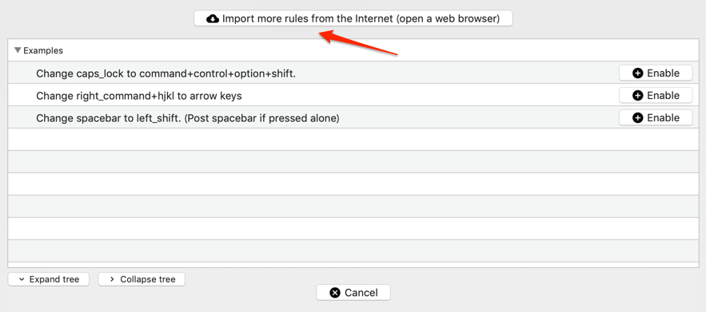

`Happy Hacking Keyboard!!`

とても楽しみにしていた「HHKB Professional BT」が届いたので試し打ちも兼ねて初期設定記事

具体的には以下3点を設定します

- HHKB接続時にMacの物理キーボードを無効化
- option + hjklをarrow keyにして移動する
- 設定モードをMac/iOSモードにする(オマケ)

今まで使ってなかったのですが、今回から[karabiner](https://pqrs.org/osx/karabiner/)を使ってみようと思います  
バージョンは以下の通りです

- Karabiner Elements 12.2.0

## HHKB接続時にMacの物理キーボードを無効化

<blockquote class="twitter-tweet" data-lang="ja">
このスタイルでいこう <a href="https://t.co/3Sw0JZeHYS">pic.twitter.com/3Sw0JZeHYS</a>
&mdash; せいけしろー (@seike460) <a href="https://twitter.com/seike460/status/1108538306227126272?ref_src=twsrc%5Etfw">2019年3月21日</a></blockquote>

このスタイルで使いたいわけですが、Macのキーボードが反応してしまうのでそれを無効化します  
またHHKB持っていない瞬間もあるだろうなと思ったので、HHKB非接続時は有効化します

まずは普通にサイトから「Download Karabiner-Elements-12.2.0」を押してダウンロード  
インストールして起動し、`Devices`を開きます

`Disable the built in keyboard when one the following selected devices is connected`  
と今回にピッタリの設定があったのでこれを有効化して終了

## option + hjklをarrow keyにして移動する

Professionalと言えば`fn + ;/['`が arrow keyになっているのですがわりと変則的です  
僕はHHKB Liteをかなり長い間利用している時期があり、先輩が使ってるProfessionalを見て  
物理キーボードを取り外していた時期がありました  
(今思うとなんでそんな事してたんでしょうね)  

その恩恵で違和感なく今も使えているのですが  
vimmerとしては`hjkl`で移動できると思考せずとも反射で使えて便利なのではと思いました  

これもkarabinerで楽勝です

`Complex Modifications`の`Add rule`

`Import more rules from the Internet`

`Search Keyword`にて`arrow`で検索して`Vi Style Arrows`を`Import`

`Change Option + h/j/k/l to Arrows`を有効化

これで `Option + hjkl`で移動できます

とは言え書きながら`fn + ;/['`を反射レベルで使ってたので別に必要ないかもしれませんね

## 設定モードをMac/iOSモードにする

これは説明書どおりにDIPスイッチを`SW1 OFF + SW2 ON`にすれば良いです

## 所感

HHKB Professional、とても気持ちいいです
