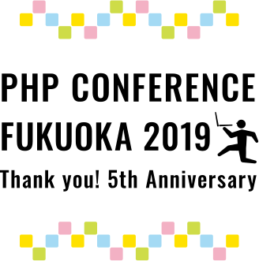

PHPカンファレンス福岡2019に複数の役割で関わらせて頂きました

## 登壇者として

### 発表資料

[Monitoring PHP](https://slide.seike460.com/slides/phpconfuk2019#/)

### 発表内容

[PHPerKaigi2019](https://phperkaigi.jp/2019/) からの内容だったのですが、最近取り組んでるモニタリングに関して話しました  
なんとなくではなくて、意義のあるモニタリングを行う話  
それを行う為に「何故」「何を」「どのようにして」を話しました

福岡でモニタリングをしてる悩みを相談出来る様になればいいなという想いもあります

### 所感

Ask The Speakerにて次のセッションが終わるくらいは複数人と話し込んでいたので、  
興味持ってくれた人がいたのは素直に嬉しかったです  

ただたからこそ30分で話したかった...(30分 -> 15分になったセッション)  
構成上、実際のモニタリングの様子を説明する箇所までどうしても辿り着けなかったのが心残りです  
最近15分じゃ足りないので、長めのセッションを狙って登壇したいと思いました

思えば3年連続なので来年も登壇したいなぁ…

## スタッフとして

### カンファレンス前

主にスポンサー対応を行ってました。  
スポンサー様はみなさんとても柔らかく対応頂けており、メールを書くのが苦ではありませんでした  
ただ僕が即対応出来ていない事、メールが分かり辛い問題もあったのが少し反省点...

@tsubakimoto_sさんと@akase244さん、最後に本気を出す@cakephperさんを軸に準備が進みました

この人たち優秀で、仕事も出来るんだろうなと思いながら自分の出来る事をやってました

そして僕はスポンサー対応をしてたので表に名前が出やすかったのですが、  
実際に関わることでそれ以外にもデザイン系、発注系、受付系、精算系等など、  
カンファレンスを支えてくれているスタッフがいっぱいいることに気づきました。

是非皆様、ココの方たちにご注目ください。

# [PHPカンファレンス福岡2019 STAFF](https://phpcon.fukuoka.jp/2019/#staff)

### 前日

#### 袋詰編

恒例の袋詰、実は僕は初めての参加です  
「マジで終わらないから」という話を聞いて少しビビってたのですが、  
`0.2セット/sec` という驚異のパフォーマンスを叩き出して大成功に終わりました

<blockquote class="twitter-tweet" data-lang="ja">
袋詰め作業のスループット 0.2セット/sec <a href="https://twitter.com/hashtag/phpconfuk?src=hash&amp;ref_src=twsrc%5Etfw">#phpconfuk</a>
&mdash; cakephper (@cakephper) <a href="https://twitter.com/cakephper/status/1144526003730915328?ref_src=twsrc%5Etfw">2019年6月28日</a></blockquote>

パフォーマンス向上の原因は今までのPHPカンファレンス福岡で袋詰して来て鍛えられたスタッフと  
他カンファレンスで鍛えられたサポーターが合わさった相乗効果ですね

無心でやるよと言われてたのですが、流れる様に進む袋詰のボトルネックにならないように必死でした

サポーターの皆様、本当にありがとう御座います

### 前夜祭編

登壇者 & スポンサー & スタッフの前夜祭へ

いろんな人とお話しようと席を動き回ってました  
準備頑張ったねとスタッフと話したり、他のカンファレンスで知り合った方と再開したり  
楽しく過ごさせてもらいました。

次のエールズは(少しだけしか)飲まないぞ！と決めていたので少し飲み過ぎた気がしなくもない

### エールズ(金曜日)編

明日があるのはわかったのですが、どうしてもここには行きたい...  
3杯だけと決めて参加、県外の方が中心に参加している様でとても贅沢な時間になりました  
来年も@cakephperさんが開催してくれる事でしょう。この日はグッと我慢して、終電帰宅

### 当日

Fusicホールの司会責任者として動いてました

実際は名ばかりで @chiyochan81 さんと @hamaco さんが慣れすぎてて別にフォロー等する必要がなく  
自分の司会に集中する事が出来ました(なんだったら、台本の赤入れされてましたw)

実際のカンファレンス中は司会中は司会に集中しながら、空き時間は出来る限りいろんな所を回って  
スタッフに話しかけたり、参加者に話しかける様にしてました。  
ただこれもスタッフ毎に判断してて、本当に困った時にスタッフ間のSlackでフォローしあったり  
僕が心配する必要なんてなかったなという気持ちにはなりました  

だからこそ、スタッフの役割を全体的に眺めれていたのですが、  
司会業等、人の目に触れる人達以上にカンファレンスを支えてくれている人がいる事を知りました

是非皆様、ココの方たちにご注目ください。(大事な事なので二回言いました)

# [PHPカンファレンス福岡2019 STAFF](https://phpcon.fukuoka.jp/2019/#staff)

とはいえ気は張っていたのであっという間にカンファレンス本祭は終わりました

### 懇親会

いっぱい飲んでました  
ここは後ほど触れますのでスッと終わります

### エールズ(土曜日)編

解禁されていたので飲もう！という気持ちだったのですが、話したいが勝って話すことに夢中でした  
酔っ払ってたので、いつものグイグイ行き過ぎる感じが出てた気がして  
迷惑をかけて申し訳ない気持ちでいっぱい

## Fusicとして

### 非公式 After Hack

ゆるふわな雰囲気で、やりたいことをして、発表したくなったら発表する場です。  
個人的に気を張らない感じで好きなのですが、参加者はどう思ってるかな〜と気になってました

このTweet見た時は、本当に嬉しかったです

<blockquote class="twitter-tweet" data-lang="ja">
アフターハックねー、いつもすげーたのしいんだよね。なんでも自由に話せる。別の勉強会だけど、はちぴーの雰囲気があるんだよね。 <a href="https://twitter.com/hashtag/phpconfuk_after_fusic?src=hash&amp;ref_src=twsrc%5Etfw">#phpconfuk_after_fusic</a> ここにまた来年もきたい。 <a href="https://t.co/SgaTKluGPL">pic.twitter.com/SgaTKluGPL</a>
&mdash; uzulla (@uzulla) <a href="https://twitter.com/uzulla/status/1145378661425700865?ref_src=twsrc%5Etfw">2019年6月30日</a></blockquote>

いつも場を盛り上げてくれる発表してくれて感謝してて、ちょっと一人泣きそうになってしまいました

@uzullaさん本当にありがとうございます

### hamaco祭り

その後恒例と聞いていた@gorogoroyasu企画 hamaco祭りへ  
今回県外からきてくれたにも関わらず、スタッフとして頑張ってくれて感謝の気持ちと  
単純にhamacoさんと話したかったので参加

焼き鳥のお店とビールのお店に向かいカンファレンスの想い出話を

ただ途中でトイレに立った時に、今まで絶え間なく注入されていた楽しいが途絶えたせいか  
完全に電池が切れました

<blockquote class="twitter-tweet" data-lang="ja">
人の電池が切れる瞬間を見た。 <a href="https://t.co/IQbNyQMtPo">https://t.co/IQbNyQMtPo</a>
&mdash; はい、あのアカセさんです。 (@akase244) <a href="https://twitter.com/akase244/status/1145346462529642496?ref_src=twsrc%5Etfw">2019年6月30日</a></blockquote>

### 最後に

### 来年のPHPカンファレンス福岡2020の委員長に選んで頂きました  
懇親会にてどちらにするか選択の余地を頂きありがとうございます！

<blockquote class="twitter-tweet" data-lang="ja">
YES or はいの現場に遭遇した<a href="https://twitter.com/hashtag/phpconfuk?src=hash&amp;ref_src=twsrc%5Etfw">#phpconfuk</a> <a href="https://t.co/c1lKgVqzgk">pic.twitter.com/c1lKgVqzgk</a>
&mdash; 藤崎優 (@youukkari) <a href="https://twitter.com/youukkari/status/1144915787389341697?ref_src=twsrc%5Etfw">2019年6月29日</a></blockquote>

PHPカンファレンス福岡前身の`fukuoka.php`は想い出深い、いわゆる#私の人生を変えた勉強会で  
PHPカンファレンス福岡は初めて登壇したカンファレンス

恩を感じずにはいられないので、全力で取り組みます

懇親会最後のあいさつでも話しましたが、カンファレンスはスタッフだけでは実現は不可能です  
登壇者の皆様、スポンサーの皆様、そして技術を楽しむ参加者の皆様  
みんなで創り上げるものだと思いました。

来年も一緒にカンファレンスを創って頂けると幸いです。

今年の実行委員長がお手本、背中を見せてくれたので、負けないように頑張りたい

本当に@tsubakimoto_sさんお疲れ様でした！

