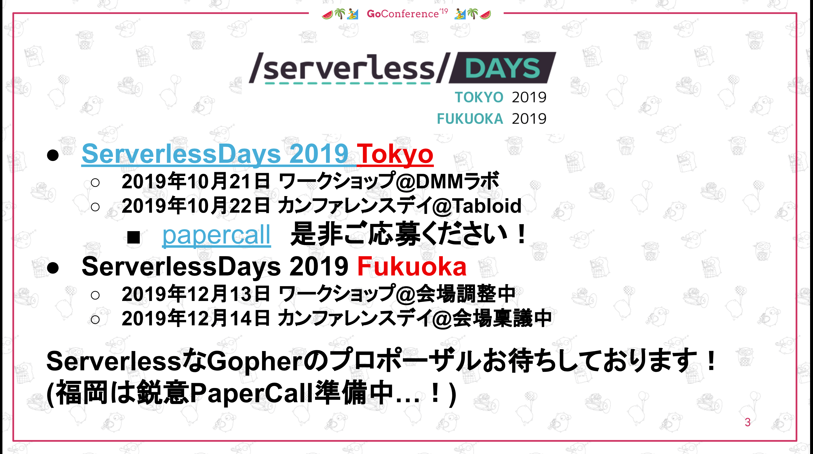

Go Conference '19 Summer in Fukuoka にて登壇とスタッフをしてきました

先々週のPHPカンファレンス福岡2019から引き続き、  
大きめのカンファレンスが立て続けでわりと個人的に盛り上がってました

fukuoka.php、fukuoka.goは不可能ではない限り行く事にしてるので、  
その2つが同時期にカンファレンスするという事に気付いた時は  
喜びと興奮とその他の感情が混ざりあわさって最高でした

## 登壇者として

### 発表資料

[ISUCONの為のpprof](https://t.co/tKEDeNOluk)

<iframe src="https://docs.google.com/presentation/d/e/2PACX-1vT_6CKyiO4nRwgO0rfvlxzSC3t-ygk5cFqgOL3EILV_G9vVoxNgFD68beacjwCT8pfr9N0XyVmt-5rR/embed?start=false&loop=false&delayms=3000" frameborder="0" width="960" height="569" allowfullscreen="true" mozallowfullscreen="true" webkitallowfullscreen="true"></iframe>

### 発表内容

今年もISUCONの時期が近づいて来ていたので pprof について話しました  
ISUCONとpprofの関係、 pprofを使う方法、pprofで出来る事、pprofを知るために行った  
ソースコードリーディングとその良さを伝えるつもりでした。

### 反省とお詫び

今回失敗したのがある程度トークする内容を決めて来てたのですが、  
コールアンドレスポンスなやり取りを行った際に、自分が想定してなかった反応で  
慌ててトークの組み換えを行いながら話してたのですが、完全に時間配分がミスって  
時間オーバーをしてしまいました...

また切替の時間が無いことも把握してたので、削った箇所や、単純に大変に焦り  
話したかったトークが出てこない箇所があり聞きに来てくれた方々に大変申し訳ない事をしました

元々トークが20分ギリギリだなと思ってたのですが、  
そもそもメインのトークを時間に余裕を持たせて終わらせる様に構成して、  
アディショナルな小さなトピックは時間を見ながら追加していく方法にしようと思いました

## スタッフとして

### カンファレンス前

基本的にSlackでやり取りをしてて、僕は出来そうな事があったら手をあげるスタイルを取ってました  
[@linyows](https://twitter.com/linyows)さんが凄くてガンガンタスクを片付けていき、  
少し考えるターンになると [@monochromegane](https://twitter.com/monochromegane)さんと議論しながら  
方向性を決めてアクションを行ってる様子は見てて非常に頼りになりました  

なんとなくじゃなくて、ちゃんと明確な意思を持って納得いくまで議論して  
決定していく様を見れただけでも、個人的にはスタッフをしてよかったと思いました

各種スポンサードの細々した手配、お店手配、ちょっとしたサイト修正、  
とりあえずSlackに反応したり、意見を書く位しか出来なかったけど、  
楽しく準備は出来たと思います。

プロポーザル選定はワガママを言って外してもらいました。  
どうしてもGo、PHP、AWS系のカンファレンスに参加するならスピーカーとして  
参加したい想いがあります

### カンファレンス前日

当日スタッフしてくれた皆さんと袋詰したり

<blockquote class="twitter-tweet" data-lang="ja">
<a href="https://twitter.com/hashtag/gocon?src=hash&amp;ref_src=twsrc%5Etfw">#gocon</a> ノベルティをビルド中 <a href="https://t.co/K1YUJ3W9h7">pic.twitter.com/K1YUJ3W9h7</a>
&mdash; L I N Y O W S 🤡 (@linyows) <a href="https://twitter.com/linyows/status/1149587073591984130?ref_src=twsrc%5Etfw">2019年7月12日</a></blockquote>

会場設営をしながらアレコレ調整したりと文化祭前日の感じが楽しかったです  

スタッフの比率としてはGMOペパボさんが大多数だったんですが、自分で考えて動く様は  
Fusicと似てる所があると思いました

前日の現場判断でも前述の二人はスパスパ判断して、理解しやすい様に言語化して伝えてる印象があり  
この動きはカンファレンス運営が控えている身としては見習いたいと思いました

### カンファレンス当日

僕は発表が控えていることもあり、基本受付担当でした  

<blockquote class="twitter-tweet" data-lang="ja">
<a href="https://twitter.com/hashtag/gocon?src=hash&amp;ref_src=twsrc%5Etfw">#gocon</a> <a href="https://t.co/5vOskzEcRm">pic.twitter.com/5vOskzEcRm</a>
&mdash; せいけしろー (@seike460) <a href="https://twitter.com/seike460/status/1149829343650045952?ref_src=twsrc%5Etfw">2019年7月12日</a></blockquote>

FusicスポンサードのTシャツが褒められ嬉しく思ったり(このGopherくんは[@keita_kawamoto](https://twitter.com/keita_kawamoto)さん作)

<blockquote class="twitter-tweet" data-lang="ja">
めっちゃいいシャツ <a href="https://twitter.com/hashtag/gocon?src=hash&amp;ref_src=twsrc%5Etfw">#gocon</a> <a href="https://t.co/XM6fnLWdmH">pic.twitter.com/XM6fnLWdmH</a>
&mdash; codehex (@codehex) <a href="https://twitter.com/codehex/status/1149843984895733760?ref_src=twsrc%5Etfw">2019年7月13日</a></blockquote>

高島市長が来てくれた事に感動したり

<blockquote class="twitter-tweet" data-lang="ja">
高島市長の引き込み方すごい、まるで自分にだけ語りかけられているようだ。これが150万人の都市を率いる方か… 一気に高島市長のファンになってしまったなぁ。福岡すみたい。 <a href="https://twitter.com/hashtag/gocon?src=hash&amp;ref_src=twsrc%5Etfw">#gocon</a> <a href="https://t.co/LfLkRTNhH9">pic.twitter.com/LfLkRTNhH9</a>
&mdash; 941 (@941) <a href="https://twitter.com/941/status/1149873276744687616?ref_src=twsrc%5Etfw">2019年7月13日</a></blockquote>

登壇の反省してたり

<blockquote class="twitter-tweet" data-lang="ja">
反省は終わったので、気持ちを切り替えて <a href="https://twitter.com/hashtag/gocon?src=hash&amp;ref_src=twsrc%5Etfw">#gocon</a> 始めます🍺 <a href="https://t.co/Ku9HLnNVa1">pic.twitter.com/Ku9HLnNVa1</a>
&mdash; せいけしろー (@seike460) <a href="https://twitter.com/seike460/status/1149937863707856896?ref_src=twsrc%5Etfw">2019年7月13日</a></blockquote>

PHPerを見つけて安心したり

<blockquote class="twitter-tweet" data-lang="ja">
PHPerの <a href="https://twitter.com/hgsgtk?ref_src=twsrc%5Etfw">@hgsgtk</a> さんじゃん<a href="https://twitter.com/hashtag/gocon?src=hash&amp;ref_src=twsrc%5Etfw">#gocon</a> <a href="https://t.co/vk0N55GkIz">pic.twitter.com/vk0N55GkIz</a>
&mdash; せいけしろー (@seike460) <a href="https://twitter.com/seike460/status/1149954383309762561?ref_src=twsrc%5Etfw">2019年7月13日</a></blockquote>

<blockquote class="twitter-tweet" data-lang="ja">
PHPerの <a href="https://twitter.com/cakephper?ref_src=twsrc%5Etfw">@cakephper</a> さんじゃん<a href="https://twitter.com/hashtag/gocon?src=hash&amp;ref_src=twsrc%5Etfw">#gocon</a> <a href="https://t.co/oVggjZWe84">pic.twitter.com/oVggjZWe84</a>
&mdash; せいけしろー (@seike460) <a href="https://twitter.com/seike460/status/1149960172183281664?ref_src=twsrc%5Etfw">2019年7月13日</a></blockquote>

アンケート書いて！ってアナウンスしたりしてました（是非書いてください！！！）

# [アンケートはこちら](https://docs.google.com/forms/d/e/1FAIpQLSdgaSjP5eWZO_ZNA1riLa6pKniYLUg4I4oUC90vk5i59vwvHw/viewform)

その後、[Go Conference 2019 Autumn](https://gocon.jp/)が発表されました。  
是非参加したい

その後、スタッフとして紹介されて

<blockquote class="twitter-tweet" data-lang="ja">
「次は東京でお会いしましょう、Go」とのことです。<a href="https://twitter.com/hashtag/gocon?src=hash&amp;ref_src=twsrc%5Etfw">#gocon</a> <a href="https://t.co/mBX6ly1omA">pic.twitter.com/mBX6ly1omA</a>
&mdash; P山 (@pyama86) <a href="https://twitter.com/pyama86/status/1149967392543428608?ref_src=twsrc%5Etfw">2019年7月13日</a></blockquote>

みんなで集合写真！

<blockquote class="twitter-tweet" data-lang="ja">
経費精算用エビデンスはこちら <a href="https://twitter.com/hashtag/gocon?src=hash&amp;ref_src=twsrc%5Etfw">#gocon</a> <a href="https://t.co/zCsDLKBXJW">pic.twitter.com/zCsDLKBXJW</a>
&mdash; L I N Y O W S 🤡 (@linyows) <a href="https://twitter.com/linyows/status/1150059130633068544?ref_src=twsrc%5Etfw">2019年7月13日</a></blockquote>

懇親会を挟んでスピーカーディナー！  
イカ美味しかった！

<blockquote class="twitter-tweet" data-lang="ja">
ヌーラボさん提供のスピーカーディナーです！ ヌーラボさんありがとうございます😊  <a href="https://twitter.com/hashtag/gocon?src=hash&amp;ref_src=twsrc%5Etfw">#gocon</a> <a href="https://twitter.com/hashtag/nulab?src=hash&amp;ref_src=twsrc%5Etfw">#nulab</a> <a href="https://t.co/qoehd5Vr1n">pic.twitter.com/qoehd5Vr1n</a>
&mdash; せいけしろー (@seike460) <a href="https://twitter.com/seike460/status/1150002486440161281?ref_src=twsrc%5Etfw">2019年7月13日</a></blockquote>

最後はエールズを挟んで終了！のはずが、土日の終電を完全に忘れてたので

<blockquote class="twitter-tweet" data-lang="ja">
まず土日の終電が平日と違うことを把握しました
&mdash; せいけしろー (@seike460) <a href="https://twitter.com/seike460/status/1150055632235446272?ref_src=twsrc%5Etfw">2019年7月13日</a></blockquote>

ラーメン食べてました

<blockquote class="twitter-tweet" data-lang="ja">
これが福岡 <a href="https://t.co/tb3POu3GNd">pic.twitter.com/tb3POu3GNd</a>
&mdash; せいけしろー (@seike460) <a href="https://twitter.com/seike460/status/1150065126478712832?ref_src=twsrc%5Etfw">2019年7月13日</a></blockquote>

## 所感

楽しかった、この一言に尽きますね

PHPカンファレンス福岡、Go Conference '19 Summer in Fukuokaを  
同時期に経験できたのはとても良い経験になりました  

カンファレンス運営って違いがあるなと実感したのと  
コミュニティ運営のキーマンは複数人いると良いなと思いました。  

[@akase244](https://twitter.com/akase244)さん、[@cakephper](https://twitter.com/cakephper)さん  
[@linyows](https://twitter.com/linyows)さん、[@monochromegane](https://twitter.com/monochromegane)さんみたいな違うタイプのキーマンが揃うと、  
視野が広がるというか議論が出来て良いんだろうなという知見も得ました

## 次

個人的に次はServerlessDays 2019 Tokyo/Fukuokaです！  
興味がある皆さま是非ご参加を！

# [ServerlessDays 2019 Tokyo](https://tokyo.serverlessdays.io)

- 2019年10月21日 ServerlessDays Tokyoワークショップ@DMMラボ
- 2019年10月22日 ServerlessDays Tokyoカンファレンスデイ@Tabloid

# ServerlessDays 2019 Fukuoka

サイト準備中...

- 2019年12月13日 ServerlessDays Fukuokaワークショップ@天神駅周辺
- 2019年12月14日 ServerlessDays Fukuokaカンファレンスデイ@博多駅周辺

