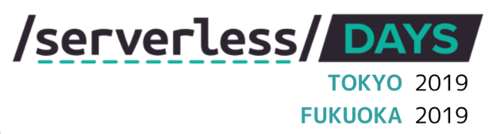

[前回](https://blog.seike460.com/2019/07/14/gocon_fukuoka2019/)の最後でも書きましたがServerlessDays 2019の準備を進めています。

### <a href="https://tokyo.serverlessdays.io" target="_blank">ServerlessDays 2019 Tokyo</a>

- 2019年10月21日 ServerlessDays Tokyoワークショップ@DMMラボ
- 2019年10月22日 ServerlessDays Tokyoカンファレンスデイ@Tabloid

### <a href="https://fukuoka.serverlessdays.io" target="_blank">ServerlessDays 2019 Fukuoka</a>

- 2019年12月13日 ServerlessDays Fukuokaワークショップ@天神駅周辺
- 2019年12月14日 ServerlessDays Fukuokaカンファレンスデイ@LINE Fukuoka

ServerlessDays Japan Tour 2019 に関する全体的な話は[@yoshidashingo](https://twitter.com/yoshidashingo)さんがブログを書いてます  
是非そちらも合わせて御覧ください。

- <a href="https://yoshidashingo.hatenablog.com/entry/sdays2019" target="_blank">ServerlessDays Tokyo / Fukuoka 2019 を開催します</a>

## スポンサーを募集しています！

ServerlessDays は非営利なイベントですので、  
ServerlessDaysを一緒に盛り上げてくれるスポンサーを募集しています

ご興味のある方、公式サイトの募集要項を確認頂き、お気軽にお問い合わせください

https://fukuoka.serverlessdays.io/#sponsors

※福岡、東京あります。是非福岡のコミュニティに興味のある方はご確認ください

## 何故ServerlessDays Fukuoka 2019を行うのか

僕は何故ServerlessDays Fukuoka 2019を行うに至ったかを書こうと思います  

[@k1LoW](https://twitter.com/k1LoW)さんの影響を受けてサーバーレスアーキテクチャを案件に取り入れたり  
サーバーレスに関する情報を集める様になりました  

そんな僕が福岡で行ってた[Serverless Meetup Fukuoka](https://serverless.connpass.com/event/120972/)に興味を持ったり  
去年カンファレンスブランド変更前のServerlessconf Tokyo 2018に参加したのは自然な事でした

Serverlessconfで行われた数々のセッションを聞いて以下の様な事を感じてました

- 技術者としての楽しさ
- サーバーレスを導入する意義
- サーバーレスは今後普通に使われる様になる

コミュニティに育てられてきた自分としてはこの東京での体験を福岡の方々にも感じてもらいたい  
そんな場を提供出来ないかと考え、Serverlessconfの懇親会で地方開催などは出来ないかと[@yoshidashingo](https://twitter.com/yoshidashingo)さんに相談してました

するとある日連絡頂き、WEB MTGの場で福岡で本当にやりたいかを問われました

かなり大きな責任を伴う問いだと今思えば思うのですが、今年からたまたま  
PHPカンファレンス福岡2019、Go Conference '19 Summer in Fukuokaの運営としての関わる事ができ  
運営としての経験値を貯める事が確定してた事、開催時期がその２つから半年後で経験を反映出来る事  
そんなタイミングでブランドチェンジが行われた事、全てが用意された様に思え、  
コミュニティに`新しい場の提供`という恩返しのチャンスだと感じて開催させてほしい旨を伝えました

## 福岡にてサーバーレスを議論出来る場を提供したい

サーバーレスはどんどん当たり前の技術になっていくと思います  
そんな技術に関する議論が出来る場を提供したい想いでこのカンファレンスを開催します

世界でのサーバーレスの現状、東京でのサーバーレスの現状、  
そして福岡でのサーバーレスの現状を議論出来る場になれば良いと思います  
是非福岡にて既に実践されている方々のプロポーザルもお待ちしております

CFPの要項は公開されておりますが、応募開始は8月を予定しております。  
状況により、もっと早く応募が開始されるかも知れません。

https://www.papercall.io/slsdaysfukuoka2019

いち早く状況を知りたい方は以下のGoogleフォームからメールアドレスを登録ください  
お知らせ事項がございましたら、Emailでご連絡致します

[ServerlessDays Fukuoka - Email notifications](https://forms.gle/HPCXnrR6hMZDNDTc6)

また公式Twitterもフォローするとそちらから情報が提供されます  
合わせてフォローください

[Serverless(JP)](https://twitter.com/serverlessjp)

## 一緒に場を創ってくれるサポーター、スタッフを募集しています

福岡には今複数人の Co-Chairs がいるのですがCo-Chairsだけで当日の対応含め  
全てをやりきることは難しいかと思っています  

福岡にてサーバーレスを議論する場を創ってくれる方を募集しています

このカンファレンスの先にある世界も含めて、一緒に創りあげていきましょう
