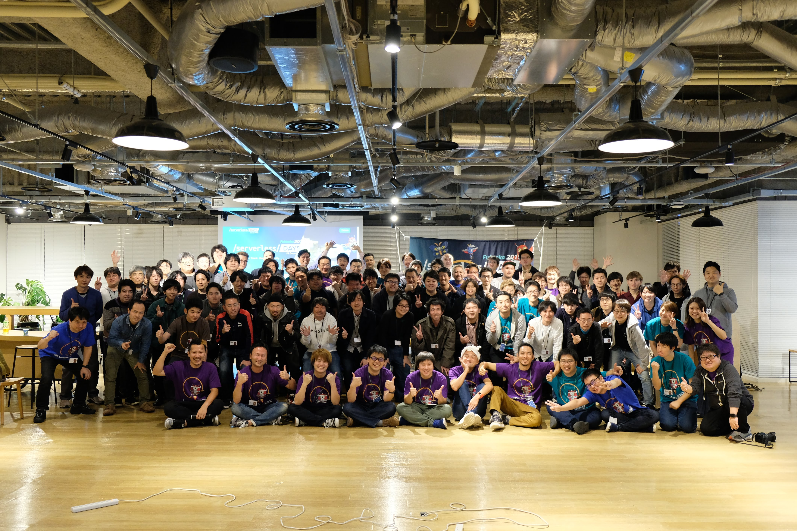
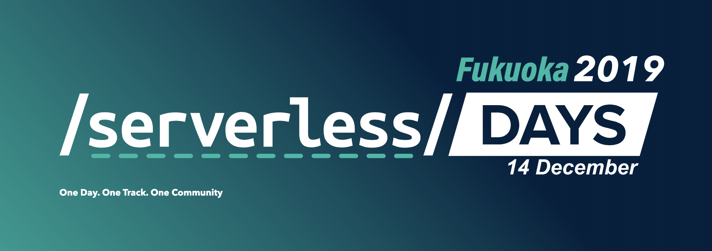
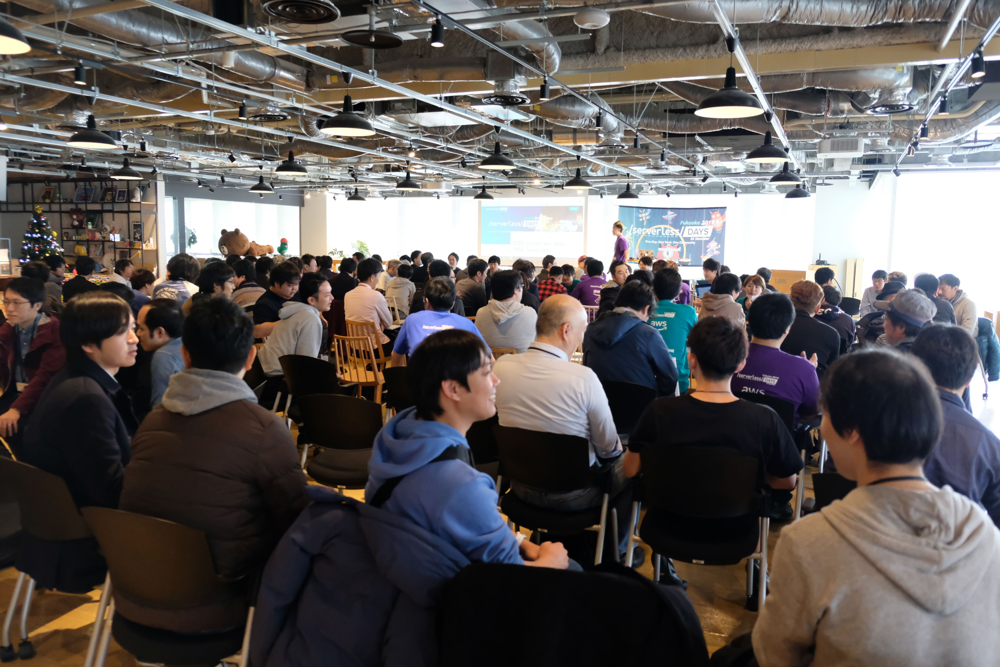

日本のサーバーレスコミュニティでは初めての地方版カンファレンス  
ServerlessDays Fukuoka 2019 を開催しました。

## ServerlessDays Fukuoka 2019

福岡の規模感からエイヤで決めた集客数も超えてとても安心したのが正直な所だったのですが、  
参加率の高さ、Twitterでの反応や懇親会での反応  
まだ集めきれてないですが、現状のアンケート満足度も5段階評価での`4.75`と嬉しい状況です

## 参加者

- 参加総人数:125 + α
    - 参加者:93
    - スタッフ:15
    - スピーカー:17
    - 開場関係者:若干名

## 当日イベントの写真集

写真をクリックすると当日様子を撮影したGoogle Photosが開きます

## Togetter

[@yoshidashingo](https://twitter.com/yoshidashingo)さんがまとめてくれました

### [ServerlessDays Fukuoka 2019 #ServerlessDays #serverlessfukuoka at @LINE_DEV Fukuoka](https://togetter.com/li/1442717)

## アンケート

- 総数:20
- 5段階評価:4.75
- また参加したいか?
    - 100%が参加したい

### アンケートコメント抜粋

- 普段あまり聞けない話を聞けてよかった。  
特にサーバーレスのテストについての知見、レイヤごとに意識すべき観点のあたり
- 私用のため午後のセッションからの参加でしたが、和気藹々とした感じができていたため、  
入りにくいような雰囲気はありませんでした。  
ケーススタディを中心とした発表で、内容もイメージしやすく、  分野も様々だったので、  
とても広い範囲の情報を得られたように思います。
- ストレッチが定期的にあるのが良かったです！
- 最高のイベントでした。ワークショップ、発表、懇親会まで全て楽しかったです。
- 途中のエクササイズ、地味に良かった  公開されたスライドがどこかにまとめてくれると大変助かります
- いろいろな取り組み、成功事例、トライした失敗談など、非常に有難いイベントでした。  
講演セッション、懇親会とも楽しむことができました。
- カンファレンスの雰囲気作りやスピーカー、参加者への気配りが随所に見られ、居心地良かった。  
運営についても勉強になりました。
- 楽しかった！会場のアクセスすごく便利、助かります。
- 今回は東京からの遠征参加となりました。  
Serverless Days Tokyoに続いての参加でしたが、わざわざ足を運んだ甲斐はあったと思っています。  
技術発表だけがメインじゃない点がServerless Daysの良いところかと。
- 面白い話を沢山聞くことができました。経験に基づく話は面白いです。
- 大変充実したイベントでよかったです。  
1日目はAWSのワークショップに参加しましたが、大変興味深い内容でした。  
2日目も充実した内容で大変勉強になりました。  
ストレッチタイムのおかげで周りの方ともコミュニケーションをとれましたし、眠くならずにすみました

内容はもちろん、エクササイズ好評だなと思いました 笑  

フィードバックも次回以降は未定ですが、今後の開催を考える際に参考にしたいと思います

`皆様是非まだまだフィードバックお待ちしております！`

## 所感

個人的には集客出来たことにまず安心したのと、僕が思うより遥かに喜んで頂けたのがただただ嬉しいです  
僕がServerlessConf Tokyo 2018で感じた未来を少しでも福岡の人に届いていれば良いなと思いました。

`Everything Will Be Serverless`  
この言葉の様な未来が訪れることを信じて今後も活動を続けようと思います

<blockquote class="twitter-tweet">
個人的にひとつやり切った感あるな。 ありがたいお言葉も頂けたし。 最後にもう一度、  Everything will be Serverless.<a href="https://twitter.com/hashtag/serverlessdays?src=hash&amp;ref_src=twsrc%5Etfw">#serverlessdays</a> <a href="https://twitter.com/hashtag/serverlessfukuoka?src=hash&amp;ref_src=twsrc%5Etfw">#serverlessfukuoka</a>
&mdash; Keisuke Nishitani (@Keisuke69) <a href="https://twitter.com/Keisuke69/status/1205825593108942849?ref_src=twsrc%5Etfw">December 14, 2019</a></blockquote>

## 後日談

ServerlessDays Tokyo のメインでチェアをやってる吉田さんが  
ServerlessDays Fukuokaに関して纏めた連投ツイートがめちゃくちゃ嬉しかったのでのせておきます

<blockquote class="twitter-tweet">
(1)福岡でメインのチェアをしたのはFusicの清家くん。Serverlessconf Tokyo 2018の懇親会で福岡で自分もこういうのをやりたいと直談判があったので。  ServerlessDays Fukuoka 2019 <a href="https://twitter.com/hashtag/ServerlessDays?src=hash&amp;ref_src=twsrc%5Etfw">#ServerlessDays</a> <a href="https://twitter.com/hashtag/serverlessfukuoka?src=hash&amp;ref_src=twsrc%5Etfw">#serverlessfukuoka</a> at <a href="https://twitter.com/LINE_DEV?ref_src=twsrc%5Etfw">@LINE_DEV</a> Fukuoka - Togetter <a href="https://t.co/XJqEWKhgDm">https://t.co/XJqEWKhgDm</a>
&mdash; 真吾 | Shingo Yoshida (@yoshidashingo) <a href="https://twitter.com/yoshidashingo/status/1206045396205629440?ref_src=twsrc%5Etfw">December 15, 2019</a></blockquote>
